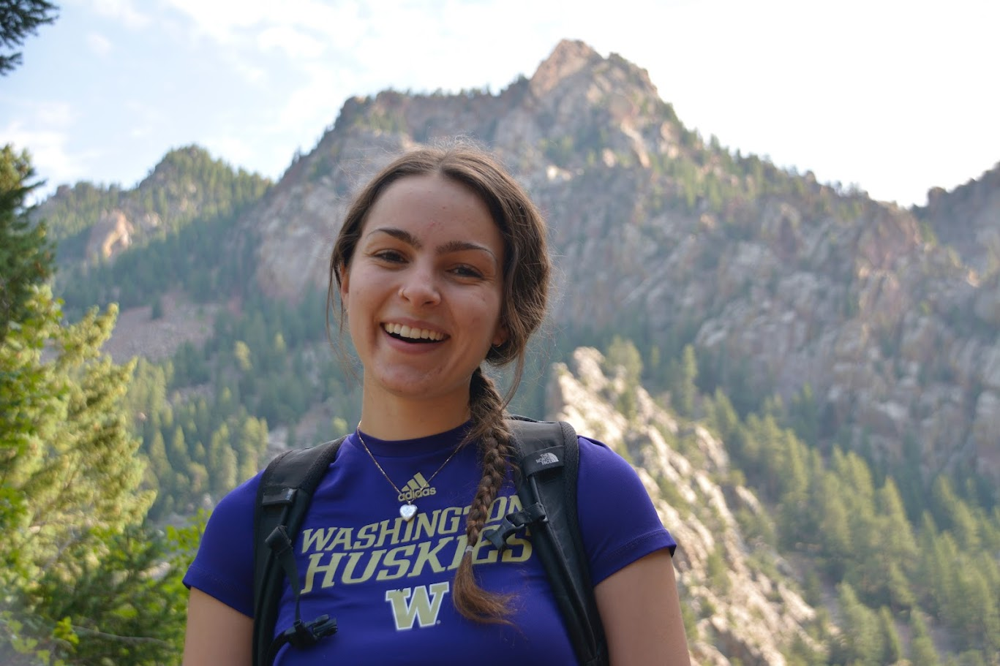

## Hi, I'm Annabel 👋

I am a senior undergraduate at the University of Washington majoring in Applied Mathematics: Data Science with a minor in Oceanography. I am currently working on deep learning based smoke detection in collaboration with NOAA Global Systems Laboratory ([SmokeViz](https://github.com/annabelwade/SmokeViz/tree/test-set-analysis)) and previously worked on mapping ocean energetics at the UW School of Oceanography ([OceanSciencesMeeting24-poster](https://github.com/annabelwade/OSM24-poster-Wade/blob/main/OSM24_Wade_Poster.pdf)).

My research interests include analyzing large geospatial datasets and developing machine learning workflows for gaining environmental insights in application areas like 
- wildfires 🔥
- predicting future climate 🌎
- extreme weather events ⛈️
- changes in food systems 🌾.

In my free time, you can find me biking 🚲, taking care of my 2 cats 🐈🐈‍⬛, and cooking 🥘.

Reach me at `annawade` at `uw` dot `edu`!
